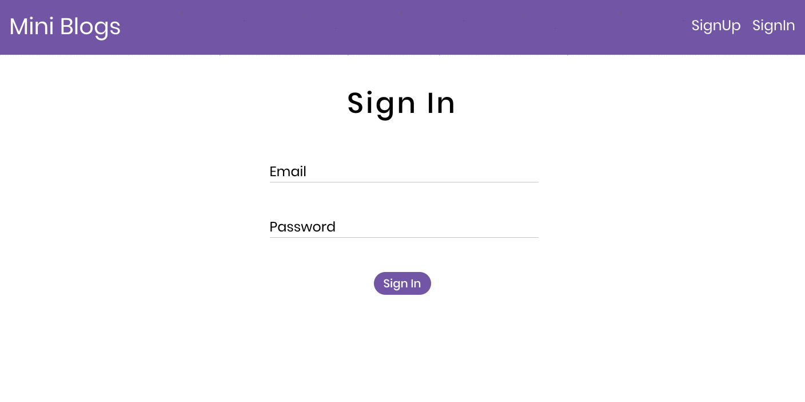
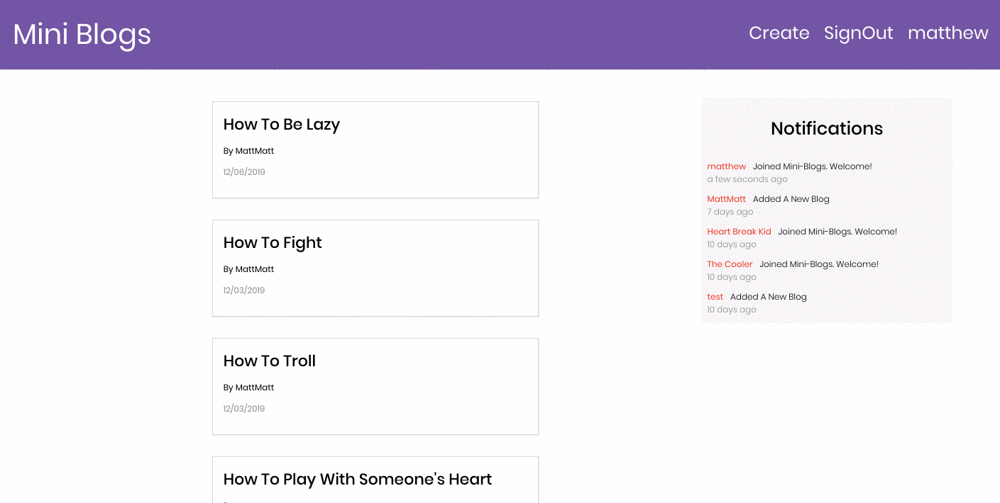

# MiniBlogs
Short and Straight To The Point Blogs

## Demo
https://mini-blogs.firebaseapp.com/

## Sign In and Sign Up With Firebase Auth

## Creating a Mini Blog

## Dependencies

* React Redux
* Firebase, Firestore, Functions

## Stories

* Users can sign up and sign in using Firebase auth.
* Users can sign out.
* Users can post new mini blogs.
* When logged in, users can view other user's blog post.
* All users can see the top 3 activities of other users via notifications.
